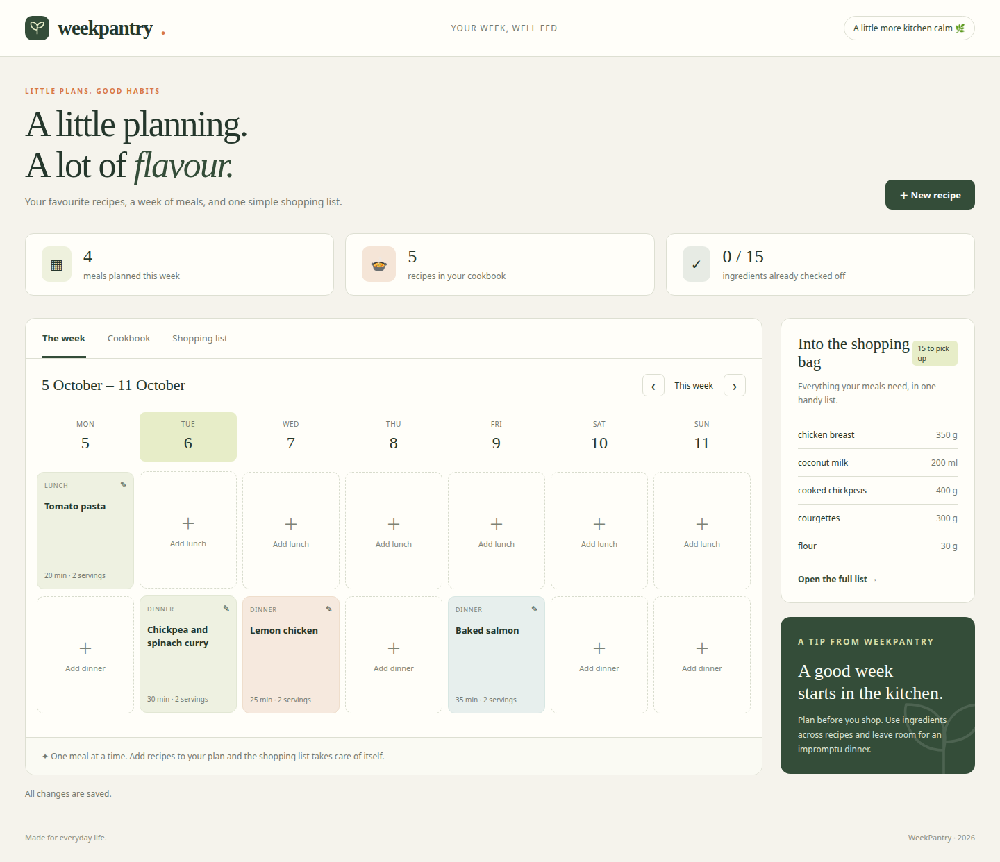
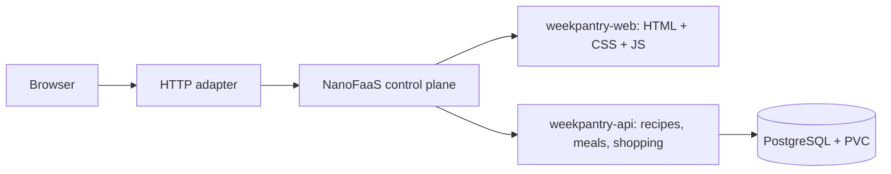

# WeekPantry

**Your week, well fed.** A household recipe book, weekly meal planner and
portion-aware shopping list, built with [NanoFaaS](https://github.com/miciav/nanofaas).



Save recipes, plan lunch and dinner, and get a shopping list that follows your
servings. Search by recipe or ingredient, filter by category, check off groceries
and print your list. Five recipes and four meals help you get started. Everything
is in English, including the sample recipes, validation messages and documentation.

Python 3.12 · FastAPI · PostgreSQL · plain HTML/CSS/JavaScript · k3s.
No frontend build or NanoFaaS SDK is required.

## How it uses NanoFaaS



Both functions run as `DEPLOYMENT` functions managed by NanoFaaS on Kubernetes.
**The frontend is served through NanoFaaS too.** Every GET `/` invokes
`weekpantry-web`, which returns the complete HTML document with its CSS and JS.
The browser response carries `X-Execution-Id` as evidence of that execution.

The HTTP adapter contains only `edge.py`: no HTML, assets or database code. It
calls the NanoFaaS control plane for every page and API request. It translates
GET `/` to `{"input":{"action":"page"}}` and unwraps the JSON
`InvocationResponse` into HTML. POST `/api` invokes `weekpantry-api` and preserves
application status codes and execution IDs. Platform management routes are not
exposed through the adapter.

PostgreSQL is a separate StatefulSet, outside NanoFaaS. Recipes, meals, shopping
checkboxes and a mutation ledger live on its PVC. Mutations carry a client UUID
`requestId`, recorded in the same transaction as the change. Replaying an old
request after a restart cannot overwrite a newer edit.

## Deploy to an existing k3s cluster

You need Docker, kubectl, Helm, Python >=3.12, curl, GNU tar, a default
StorageClass and an image registry reachable from the nodes. The kubeconfig
must point to the cluster you intend to use.

The upstream NanoFaaS source repository is currently private. For the default
chart download, install GitHub CLI (`gh`) and authenticate an account with
access to `miciav/nanofaas`. Alternatively, set `NANOFAAS_CHART` to an already
available, dependency-built chart. The default control-plane image itself is
publicly available. WeekPantry does not redistribute private platform source.

Clone this repository; a NanoFaaS source checkout is not needed:

```bash
git clone https://github.com/Nanofaas/weekpantry.git
cd weekpantry
export FUNCTION_IMAGE=registry.example/weekpantry/function:1
export EDGE_IMAGE=registry.example/weekpantry/edge:1
docker build --target function -t "$FUNCTION_IMAGE" .
docker build --target edge -t "$EDGE_IMAGE" .
docker push "$FUNCTION_IMAGE"
docker push "$EDGE_IMAGE"
bash deploy.sh
```

Replace the example registry. Use immutable image tags and build for your nodes'
architecture. An HTTP registry needs a k3s mirror configuration; this script does
not configure the cluster. For private registries, configure imagePullSecrets in
the function specs and adapter manifests.

`deploy.sh` downloads the upstream NanoFaaS Helm chart at commit
`4f3d58b73a9cc3a81ba069ea21806e2e57c3857f` and builds its locked dependencies.
It uses authenticated `gh` access if the anonymous download fails.
The chart and default control-plane image are version `0.22.0`.
It creates resources in namespace `weekpantry`: random database credentials,
a NanoFaaS Helm release, PostgreSQL, the adapter, and a function-registration Job.
Existing Secrets and database data are preserved on subsequent deployments.

Open **http://&lt;node-ip&gt;:30188**. Alternatively:

```bash
kubectl -n weekpantry port-forward svc/weekpantry-web 8188:80
# Open http://localhost:8188
```

Optional deployment settings:

| Variable | Purpose |
| --- | --- |
| `NODE_PORT` | NodePort, default `30188`; choose another free port for an existing lab |
| `NANOFAAS_CHART` | Local, dependency-built chart directory for an offline or custom deployment |
| `NANOFAAS_REF` | Full upstream commit SHA, overriding the pinned chart revision |
| `CONTROL_PLANE_VALUES` | Additional Helm values, for example a locally available control-plane image |
| `KUBECTL_BIN`, `HELM_BIN` | Paths to the kubectl and Helm executables |

A namespace `LimitRange` gives function containers requests of 50m CPU / 128Mi
memory and limits of 1 CPU / 256Mi. The app omits `FunctionSpec.resources` because
explicit resources broke catalog reload in the lab image. See
[NANOFAAS-NOTES.md](NANOFAAS-NOTES.md) for the finding and workaround.

Repeat the build and deploy with new tags to update the app. NanoFaaS PATCH does
not update image/env, so the registration Job replaces changed function
definitions. This briefly interrupts service; the database is preserved.
An identical deploy leaves the two functions in place.

## State and credentials

The PostgreSQL application user `weekpantry` owns its database and is not a
superuser. Passwords are generated into Kubernetes Secrets, never source files
or logs. NanoFaaS 0.22.0 accepts only literal function environment variables, so
the registration Job must copy the app password into the platform catalog.
That limitation is recorded in the development notes.

This is a shared household demo without accounts. Database storage is on PVC
`data-postgres-0`; deleting the namespace or PVC deletes your data. Local k3s
storage survives pod restarts but does not protect against node loss. Manage
backups with PostgreSQL tools. Mutation records and historical shopping
checkboxes are not automatically pruned.

Ingredient amounts range from 0.001 to 100000; servings range from 1 to 24.
Units are `g`, `kg`, `ml`, `l`, `pcs`, `tbsp` and `tsp`. Different units stay
separate. Changing a required shopping quantity resets its checkbox. The sample
recipes are seeded only once; deleting them does not make them reappear.

## Tests

Integration tests clear tables in a **dedicated test database**. Do not point
`TEST_DATABASE_URL` at the application database.

```bash
uv venv --python 3.12 /tmp/weekpantry-tests
uv pip install --python /tmp/weekpantry-tests/bin/python -r requirements.txt
docker run --name weekpantry-test-db --detach \
  -e POSTGRES_HOST_AUTH_METHOD=trust -e POSTGRES_DB=weekpantry_test \
  -p 127.0.0.1:15432:5432 postgres:17-alpine
# Wait until pg_isready succeeds before running the suite.
docker exec weekpantry-test-db pg_isready -U postgres
TEST_DATABASE_URL=postgresql://postgres@127.0.0.1:15432/weekpantry_test \
  PYTHONPATH=. /tmp/weekpantry-tests/bin/python -m unittest discover -s tests -v
docker rm -f weekpantry-test-db
```

For real browser tests, install Playwright and use a local Chrome executable
(`CHROME_BIN`, default `/usr/bin/google-chrome`):

```bash
uv pip install --python /tmp/weekpantry-tests/bin/python playwright
WEEKPANTRY_URL=http://<node-ip>:30188 /tmp/weekpantry-tests/bin/python tests/browser_regressions.py
WEEKPANTRY_URL=http://<node-ip>:30188 /tmp/weekpantry-tests/bin/python tests/browser_smoke.py
```

Browser tests create temporary recipes and clean them up. The navigation
regression uses two weeks in 2031 and restores any meals in the affected slots.
The full smoke test requires an empty test slot in 2040. Results and screenshots
are written to [evidence/](evidence/README.md).

The following test **restarts PostgreSQL, both functions and the control plane
in namespace `weekpantry`**, briefly interrupting service:

```bash
WEEKPANTRY_URL=http://<node-ip>:30188 /tmp/weekpantry-tests/bin/python tests/k3s_persistence.py
```

It compares recipes, meals and checkboxes before/after, then replays a previous
mutation to prove that a later edit is preserved. It needs an empty test slot
in 2035 and kubectl access to this namespace.

## Documentation

- [Design and implementation decisions](DESIGN.md)
- [NanoFaaS developer notes: missing features, documentation gaps and improvements](NANOFAAS-NOTES.md)
- [Verification evidence and lab details](evidence/README.md)

WeekPantry began as the Italian-language Dispensa experiment inside NanoFaaS.
This repository contains the complete application and its documentation. The
original lab remains separate; its database is not reused by the English app.
The English API uses English category, unit and meal-slot values and is not a
schema migration for existing Dispensa databases.

MIT licensed; see [LICENSE](LICENSE).
